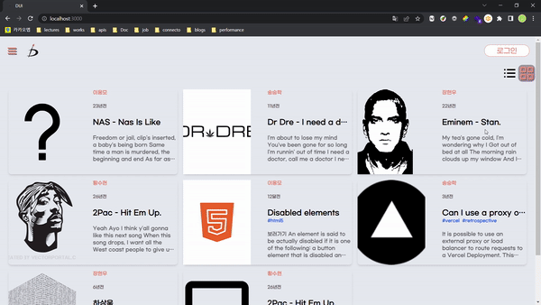
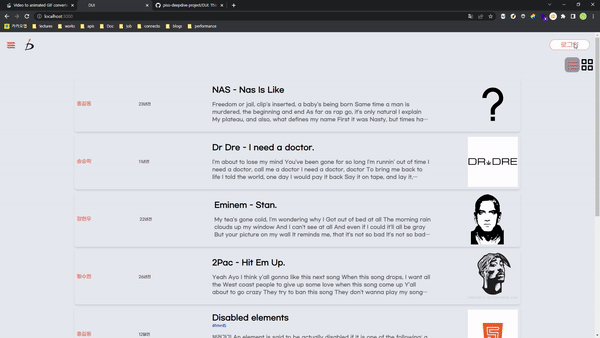
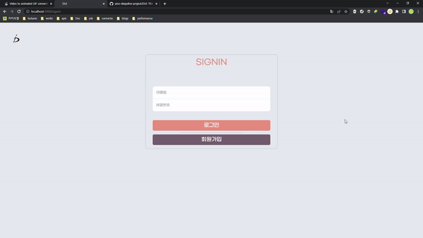

# Introduction

> DUI; Draw yoUr Idea, 나만의 생각을 작성하고 공유할 수 있는 블로그 입니다.

`vanilla javascript`
로 글을 저장하고 수정하고 삭제할 수 있는 웹 사이트 프로젝트입니다.

- [글 목록 보기](./docs/lib/page.md#list로-글-목록-보기)
  
- [로그인](./docs/lib/page.md#로그인)
  
- [회원가입](./docs/lib/page.md#회원가입)
  
- [글 보기](./docs/lib/page.md#글-보기)
- [글 편집](./docs/lib/page.md#글-편집)
- [댓글](./docs/lib/page.md#댓글)

## 프로젝트 기획

- [Use Case](./docs/usecase.md)
- [요구사항 UI 분석](./docs/requirement.md)
- [API 명세](/docs/lib/API.md)
- [컴포넌트 설명](/docs/lib/components)

## 사이트 이용방법

# Stacks Tools Library


# :date: Period

:calendar: 2022-12-12 ~ 2022-12-23

# People

| 송승학 :blush:                                             | 황수현 :laughing:                                        | 장현우 :relaxed:                                         |
| :--------------------------------------------------------- | :------------------------------------------------------- | :------------------------------------------------------- |
|  |  |  |

# Installation

# Repository Clone

```shell
$ git clone https://github.com/piso-deepdive-project/DUI.git
$ npm i
```

# Activate Server and Build

```shell
$ npm start
```

# :school: Retrospective & TroblueShooting

## [회고](./docs/retrospect/)

## 트러블 슈팅

- [Express static](./docs/trobuleshooting/01-express-static.md)
- [Vercel static](./docs/trobuleshooting/02.vercel-express-static.md)

# 프로젝트에서 집중하고자 했던 점

- 요구사항을 분석한다.
- 요구사항에 맞는 기능을 구현한다.
- 가독성을 스스로 검사한다.
- 코드리뷰를 통해 코드를 리팩토링한다.
- 추가로 필요로한 요구사항이 있는지 분석한다.
- 반복한다.

## 코드리뷰 체크리스트

- [ ] 코드가 읽기 좋은가? 가독성이 있는가?
- [ ] 불필요한 동작이 반복되지 않는가?
- [ ] 기본적인 구조를 꼭 유지해야 하는가?
- [ ] 변수명은 적절한가?
- [ ] 버그가 있진 않은가?
- [ ] 기능은 잘 동작하는가?
- [ ] 하나의 메서드가 너무 많은 일을 하진 않는가?
