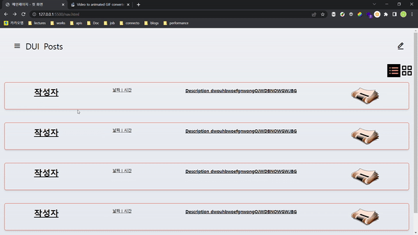
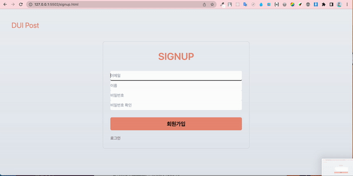

# **DUI**(**D**raw yo**U**r **I**dea) - **송승학** 장현우 황수현

## 요구사항

### 메인페이지

1. PostList에서 Post를 클릭하면 각 Post에 대한 PostDetail 페이지로 이동한다.

2. 로그인

- 로그인 버튼을 클릭하면 SignIn 페이지로 이동한다
- 로그인이 성공한다면 상단에 글작성 버튼이 추가된다.
- 글작성 버튼 클릭시 Edit 페이지로 이동한다.

3. PostList

- PostList는 선택된 메뉴 타입(리스트, 그리드)에 따라 보여지는 목록의 모습이 달라진다.
- 리스트 타입에서는 페이지 번호를 이용해 페이지네이션을 구현한다.
- 그리드 타입에서는 캐러셀을 활용한다.

4. 페이지 상단 메뉴 버튼이 클릭되면 사이드 네비게이션이 토글 되도록 한다.

### SingIn

1. Validation

- 아이디 입력 필드에는 이메일, 패스워드 입력 필드에는 영문 또는 숫자를 6~12자를 입력해야 한다.
- 입력 필드에 문자를 입력할 때마다 입력된 값을 체크하지 않도록 한다. 즉, 짧은 시간 간격으로 input 이벤트가 연속해서 발생하더라도 **일정 시간 간격으로 이벤트 핸들러가 최대 한 번만 호출**되도록 한다.
- 입력 필드에 적절한 형식의 값이 입력되지 않으면 해당 입력 필드에 유효성 검증 실패를 알리는 아이콘을 표시하고 해당 입력 필드 하단에 에러 메시지를 출력한다.
- 입력 필드에 적절한 형식의 값이 입력되면 해당 입력 필드에 유효성 검증 성공을 알리는 아이콘을 표시하고 해당 입력 필드 하단에 에러 메시지를 제거한다.
- submit 버튼은 모든 입력 필드에 적절한 형식의 값이 입력되어 유효성 검증이 성공했을 때만 활성화한다.
- submit 버튼 클릭시 등록된 사용자라면 로그인 성공 및 메인페이지로 이동한다.
- submit 버튼 클릭시 등록되지 않은 사용자라면 상단에 에러 메세지를 출력한다.

2. 회원가입 버튼 클릭시 SignUp 페이지로 이동한다.

### SignUp

1. Validation

- 이름 입력 필드에는 1자 이상의 문자, 패스워드 확인 입력 필드에는 패스워드 입력 필드에 입력된 값과 동일한 값을 입력해야 한다.
- 회원가입 폼의 패스워드 입력 필드와 패스워드 확인 입력 필드에 동일한 패스워드를 입력해 유효성 검증이 성공한 다음, 패스워드 입력 필드에 다른 값을 입력하면 패스워드 확인 입력 필드에 에러 메시지와 유효성 검증 실패 아이콘을 표시한다.

2. 회원가입 성공 시 SignIn 페이지로 이동한다.

### Edit

1. 제목, 카테고리 input에서 Enter시 submit 이벤트가 발생하지 않도록 한다.

2. 뒤로가기 버튼 클릭시 이전 페이지로 이동하도록 한다.

3. 작성하기 버튼 클릭시 post 데이터를 업데이트 하고, 메인 페이지로 이동하도록 한다.

4. 카테고리 input

- 카테고리 input 에서는 enter를 통해 여러개의 카테고리를 여러개 만들 수 있도록 한다.

- 카테고리 input을 클릭시 카테고리를 입력하는 방법이 보여질 수 있도록 한다. 이 때 Slide Down/Slide Up 애니메이션을 적용한다.

