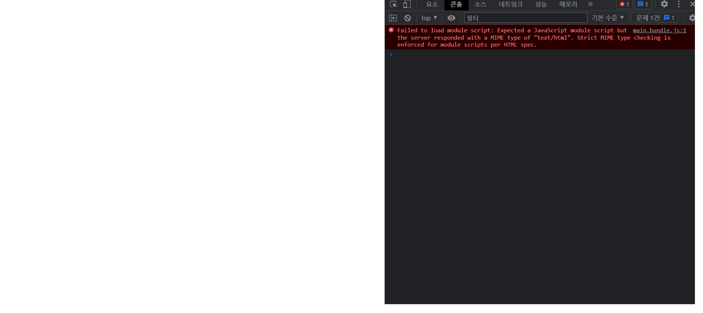

# 22-12-21

## 서버로부터 응답받은 html 파일이 렌더링되지 않는다.



## Error Message

```console
Failed to load module script: Expected a JavaScript module script but the server responded with a MIME type of "text/html". Strict MIME type checking is enforced for module scripts per HTML spec.
```

- ES module를 해석하지 못한다는 의미임을 찾았다.
- 고로 ES module를 읽을 수 없는 환경에서 해석하려 했다.
- ES module를 읽을 수 없는 환경이란?
  - Common JS 환경이거나
  - ES6 이전의 환경을 가진 브라우저 혹은 어플리케이션.

## 에러를 수정해주는 부분

```js
// Express의 static
server.use(express.static('public'));
server.use(express.json());
server.use(cookieParser());
```

### express.static

> [Express static](https://expressjs.com/ko/api.html#express.static)

- 루트 폴더를 기준으로 경로를 인수로 받아 경로의 하위 파일들은 정적파일로 보낼 수 있도록 한다.

### express response.sendFile

> [Express Response / sendFile](https://expressjs.com/ko/api.html#res.sendFile)

```js
Transfers the file at the given path. Sets the Content-Type response HTTP header field based on the filename’s extension. Unless the root option is set in the options object, path must be an absolute path to the file.
```

- 주어진 경로의 파일을 전송하며, Content-Type을 확장자를 기준으로 해석한다.

## 해결 및 결론

- sendFile 메서드로 정적인 html파일을 전송하려 한다면,
- Express static를 사용하여 html파일을 정적인 파일로 전송하도록 한다.
